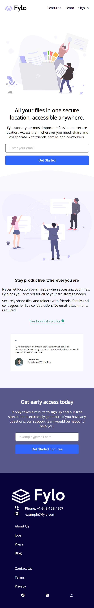
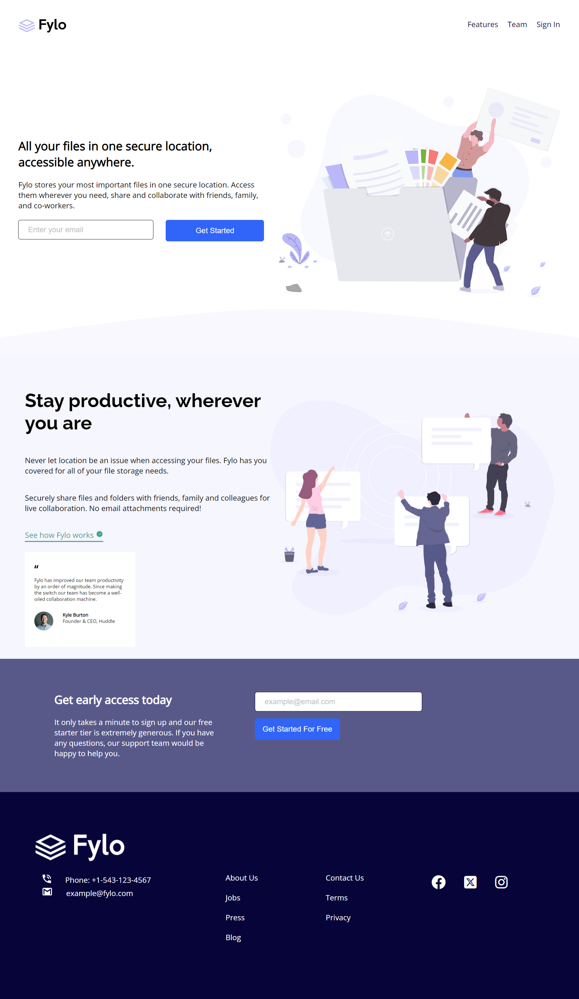

# Frontend Mentor - Fylo landing page with two column layout solution

This is a solution to the [Fylo landing page with two column layout challenge on Frontend Mentor](https://www.frontendmentor.io/challenges/fylo-landing-page-with-two-column-layout-5ca5ef041e82137ec91a50f5). Frontend Mentor challenges help you improve your coding skills by building realistic projects. 

## Table of contents

- [Frontend Mentor - Fylo landing page with two column layout solution](#frontend-mentor---fylo-landing-page-with-two-column-layout-solution)
  - [Table of contents](#table-of-contents)
  - [Overview](#overview)
    - [The challenge](#the-challenge)
    - [Screenshot](#screenshot)
    - [Links](#links)
  - [My process](#my-process)
    - [Built with](#built-with)
    - [What I learned](#what-i-learned)
    - [Continued development](#continued-development)
    - [1. Responsive Design:](#1-responsive-design)
    - [2. Performance Optimization:](#2-performance-optimization)
    - [3. Accessibility:](#3-accessibility)
    - [4. Additional Features:](#4-additional-features)
    - [5. Bug Fixes:](#5-bug-fixes)
    - [6. User Feedback:](#6-user-feedback)
    - [7. Documentation:](#7-documentation)
    - [8. Security:](#8-security)
  - [Author](#author)
  - [Acknowledgments](#acknowledgments)

## Overview

### The challenge

Users should be able to:

- View the optimal layout for the site depending on their device's screen size
- See hover states for all interactive elements on the page

### Screenshot

Mobile View - 
Mobile View - 

### Links

- Solution URL: (https://github.com/soulo-mon/fylo-landing-page-with-two-column-layout-master)
- Live Site URL: (https://soulo-mon.github.io/fylo-landing-page-with-two-column-layout-master/)

## My process

### Built with

- Semantic HTML5 markup
- CSS custom properties
- Flexbox
- CSS Grid
- Mobile-first workflow
- [Fonts](https://fontawesome.com/) 

### What I learned

How to use CSS Flexbox to control the arrangement and positioning of elements within a container.

How to change the order of flex items using the order property.

How to create responsive layouts for different screen sizes using media queries.

How to adjust the width of elements within a flex container using the flex property.

How to use justify-content and align-items properties to control horizontal and vertical alignment.

How to ensure images maintain their aspect ratio and fit within their container.

The importance of testing and debugging your layouts across different screen sizes and browsers.

### Continued development

While the current version of the project is functional and meets its primary objectives, there are still areas where I plan to continue development and improvement. Here are some of the planned enhancements and areas of focus:

### 1. Responsive Design:

- I aim to further optimize the website's responsiveness to ensure it looks and functions flawlessly on a wide range of devices and screen sizes.

### 2. Performance Optimization:

- Implement performance improvements to enhance the website's loading speed and overall user experience. This may include optimizing images, reducing unnecessary code, and leveraging caching techniques.

### 3. Accessibility:

- Enhance the website's accessibility by adhering to best practices and standards, making it usable by individuals with disabilities.

### 4. Additional Features:

- Consider adding new features or functionality to enhance the website's capabilities and user engagement.

### 5. Bug Fixes:

- Address any reported bugs or issues to ensure a smooth and error-free user experience.

### 6. User Feedback:

- Continuously gather and analyze user feedback to make data-driven improvements and prioritize enhancements that align with user needs and expectations.

### 7. Documentation:

- Keep the project's documentation up-to-date to facilitate collaboration and ease of maintenance for myself and other contributors.

### 8. Security:

- Regularly review and update the project's security measures to protect user data and prevent vulnerabilities.

As development progresses, I will update this section to reflect the latest plans and achievements. Feedback and contributions from the community are always welcome and appreciated as they play a crucial role in the project's growth and improvement.

## Author

- Website - [Udia Solomon](https://github.com/soulo-mon)
- Frontend Mentor - [@soulo-mon](https://www.frontendmentor.io/profile/soulo-mon)
- Twitter - [@soul0_mon](https://twitter.com/Soulo_mon)

## Acknowledgments

I would like to extend my appreciation to ChatGPT, the AI-powered assistant, for its invaluable assistance throughout the development of this project. ChatGPT has provided guidance, answers to my questions, and valuable insights that have contributed to the success of this endeavor.

Thank you, ChatGPT, for being a helpful resource and a key partner in bringing this project to life.

